# 社区组件库

来源：Pixso Symbol 截图整理（2026-07-31）  
范围：导航类 · 操作类 · 输入类 · 展示类 · 容器类 · 反馈类

> **文档内容载体**（图片 / 热区 / 表格语义 / 代码块 / Note / 折叠）不在本设计系统 39 组件内，见站点 [community-ui.html#cat-content](../community-ui.html#cat-content)，原则与实测自大模型抓取研究站迁入。

---

## 索引

### 导航类

| # | 组件 | 截图 |
|---|------|------|
| 1 | [OMenu 菜单](#1-omenu-菜单) | [assets/o-menu.png](./assets/o-menu.png) |
| 2 | [OTab 标签页](#2-otab-标签页) | [assets/o-tab.png](./assets/o-tab.png) |
| 3 | [OBreadcrumb 面包屑](#3-obreadcrumb-面包屑) | [assets/o-breadcrumb.png](./assets/o-breadcrumb.png) |
| 4 | [OAnchor 锚点](#4-oanchor-锚点) | [assets/o-anchor.png](./assets/o-anchor.png) |
| 5 | [OPagination 分页](#5-opagination-分页) | [assets/o-pagination.png](./assets/o-pagination.png) |
| 6 | [OStep 步骤条](#6-ostep-步骤条) | [assets/o-step.png](./assets/o-step.png) |
| 7 | [ONavigation 导航](#7-onavigation-导航) | [assets/o-navigation.png](./assets/o-navigation.png) |
| 8 | [底部导航](#8-底部导航) | [assets/o-footer-nav.png](./assets/o-footer-nav.png) |

### 操作类

| # | 组件 | 截图 |
|---|------|------|
| 9 | [OButton 按钮](#9-obutton-按钮) | [assets/o-button.png](./assets/o-button.png) |
| 10 | [OLink 链接](#10-olink-链接) | [assets/o-link.png](./assets/o-link.png) |
| 11 | [ODropdown 下拉菜单](#11-odropdown-下拉菜单) | [assets/o-dropdown.png](./assets/o-dropdown.png) |
| 12 | [ORadio 单选框](#12-oradio-单选框) | [assets/o-radio.png](./assets/o-radio.png) |
| 13 | [OCheckbox 多选框](#13-ocheckbox-多选框) | [assets/o-checkbox.png](./assets/o-checkbox.png) |
| 14 | [OSwitch 开关](#14-oswitch-开关) | [assets/o-switch.png](./assets/o-switch.png) |
| 15 | [OScrollbar 滚动条](#15-oscrollbar-滚动条) | [assets/o-scrollbar.png](./assets/o-scrollbar.png) |
| 16 | [OToggle 选择块](#16-otoggle-选择块) | [assets/o-toggle.png](./assets/o-toggle.png) |

### 输入类

| # | 组件 | 截图 |
|---|------|------|
| 17 | [OInput 输入框](#17-oinput-输入框) | [assets/o-input.png](./assets/o-input.png) |
| 18 | [OTextarea 多行文本输入框](#18-otextarea-多行文本输入框) | [assets/o-textarea.png](./assets/o-textarea.png) |
| 19 | [OSearch 搜索框](#19-osearch-搜索框) | [assets/o-search.png](./assets/o-search.png) |
| 20 | [OSelect 选择器](#20-oselect-选择器) | [assets/o-select.png](./assets/o-select.png) |
| 21 | [DatePicker 日期选择器](#21-datepicker-日期选择器) | [assets/o-datepicker.png](./assets/o-datepicker.png) |
| 22 | [TimePicker 时间选择器](#22-timepicker-时间选择器) | [assets/o-timepicker.png](./assets/o-timepicker.png) |
| 23 | [Trees 树](#23-trees-树) | [assets/o-trees.png](./assets/o-trees.png) |
| 24 | [OUpload 上传](#24-oupload-上传) | [图片卡](./assets/o-upload-image.png) · [拖拽区](./assets/o-upload-dragger.png) · [按钮+列表](./assets/o-upload-button.png) |
| 25 | [ORate 评分](#25-orate-评分) | [assets/o-rate.png](./assets/o-rate.png) |
| 26 | [OCascader 级联选择](#26-ocascader-级联选择) | [assets/o-cascader.png](./assets/o-cascader.png) |
| 27 | [OSlider 滑动条](#27-oslider-滑动条) | [assets/o-slider.png](./assets/o-slider.png) |

### 展示类

| # | 组件 | 截图 |
|---|------|------|
| 28 | [ODivider 分割线](#28-odivider-分割线) | [assets/o-divider.png](./assets/o-divider.png) |
| 29 | [OTag 标签](#29-otag-标签) | [assets/o-tag.png](./assets/o-tag.png) |
| 30 | [OBadge 徽标](#30-obadge-徽标) | [assets/o-badge.png](./assets/o-badge.png) |

### 容器类

| # | 组件 | 截图 |
|---|------|------|
| 31 | [OCarousel 幻灯片](#31-ocarousel-幻灯片) | [assets/o-carousel.png](./assets/o-carousel.png) |
| 32 | [ODialog 对话框](#32-odialog-对话框) | [assets/o-dialog.png](./assets/o-dialog.png) |
| 33 | [OCard 卡片](#33-ocard-卡片) | [assets/o-card.png](./assets/o-card.png) |
| 34 | [Odate-table 数据表格](#34-odate-table-数据表格) | [assets/o-date-table.png](./assets/o-date-table.png) |

### 反馈类

| # | 组件 | 截图 |
|---|------|------|
| 35 | [OProgress 进度条](#35-oprogress-进度条) | [assets/o-progress.png](./assets/o-progress.png) |
| 36 | [OMessage 消息提示](#36-omessage-消息提示) | [assets/o-message.png](./assets/o-message.png) |
| 37 | [OToast 轻提示](#37-otoast-轻提示) | [assets/o-toast.png](./assets/o-toast.png) |
| 38 | [气泡卡片](#38-气泡卡片) | [assets/o-popover.png](./assets/o-popover.png) |
| 39 | [OLoading 加载](#39-oloading-加载) | [assets/o-loading.png](./assets/o-loading.png) |

---

## 1. OMenu 菜单

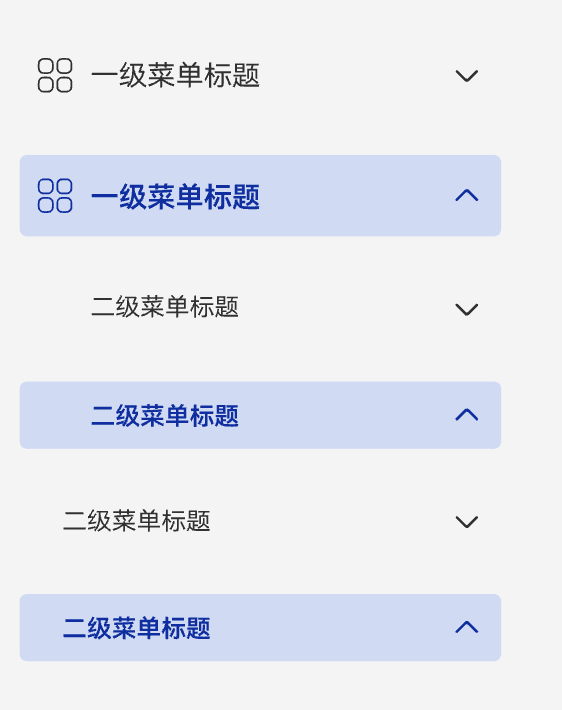

**用途：** 侧栏 / 层级菜单，支持一、二级展开。

**结构**
- 一级：左宫格图标 + 标题 + 右展开箭头
- 二级：缩进、无左图标 + 标题 + 右箭头

**状态**
| 状态 | 表现 |
|------|------|
| 默认 | 深灰字 / 灰图标，透明底，箭头向下 |
| 选中 / 展开 | 浅蓝圆角底，蓝字 / 蓝图标，箭头向上 |

**备注：** 选中条为整行圆角高亮；层级靠缩进区分。

---

## 2. OTab 标签页

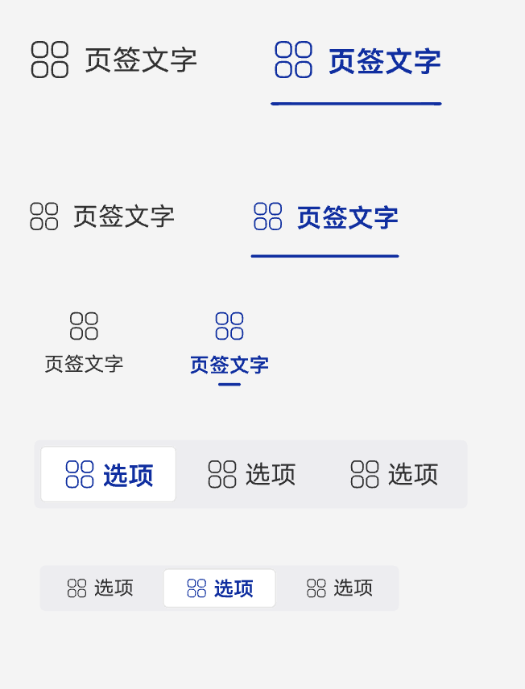

**用途：** 内容分区切换；稿中含 5 种形态。

| 变体 | 说明 |
|------|------|
| 通栏下划线 | 图标 + 文案横排；选中通栏蓝底边 |
| 文字下划线 | 同上，下划线宽度贴近文案 |
| 上图下文 | 图标在上、文案在下；选中短蓝下划线 |
| 大分段控件 | 浅灰圆角容器 + 多选项；选中白底浮起 + 蓝字 |
| 小分段控件 | 同结构，更紧凑 |

**状态：** 默认深灰；选中品牌蓝（字 / 图标 / 指示条）。

---

## 3. OBreadcrumb 面包屑

**用途：** 展示当前页在站点层级中的路径。

**结构：** `首页 > 一级页面 > … > 当前页面`  
分隔符为 `>`。

**状态**
| 项 | 表现 |
|----|------|
| 祖先页 | 中灰字，可点击 |
| 当前页 | 深蓝加粗，不可点（或非链） |

---

## 4. OAnchor 锚点

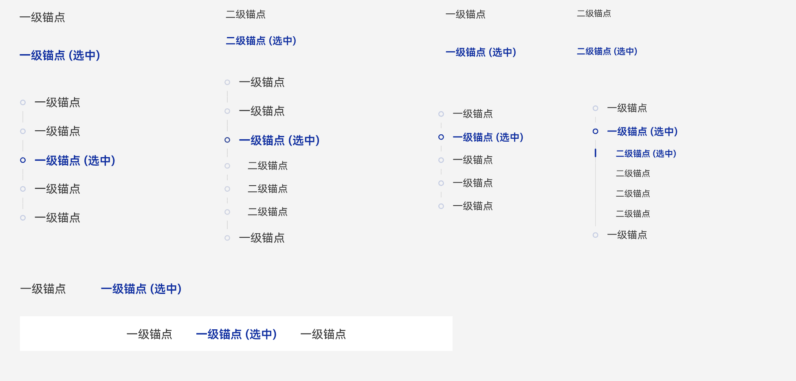

**用途：** 长文 / 侧栏目录跳转；支持一、二级。

**竖向变体**
- 竖线 + 空心圆节点
- 嵌套二级缩进
- 选中：蓝字；可选实心蓝点 / 左侧蓝竖条指示

**横向变体**
- 纯文字并排；选中蓝字
- 白底条内容纳多锚点（类顶部分区）

---

## 5. OPagination 分页

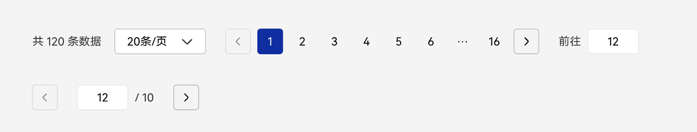

**用途：** 列表翻页。

**完整版**
- 左侧：总数文案（如「共 120 条数据」）+ 每页条数下拉
- 中部：上一页 / 页码（当前页深蓝底白字）/ 省略号 / 末页 / 下一页
- 右侧：「前往」+ 页码输入框

**简洁版**
- 上一页 + `当前页输入 / 总页数` + 下一页

**样式：** 白底、浅灰描边、小圆角；禁用箭头更浅。

---

## 6. OStep 步骤条

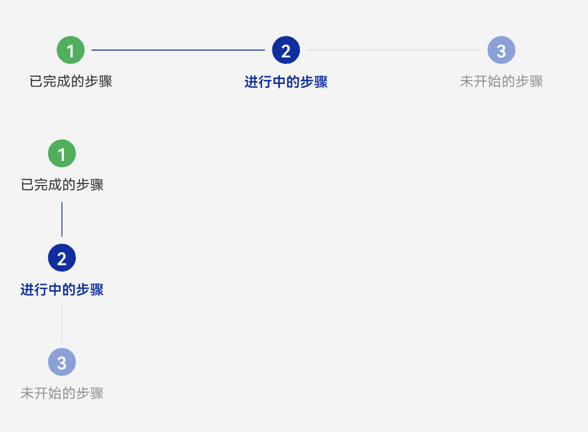

**用途：** 流程进度（横 / 竖）。

| 状态 | 圆点 | 文案 | 连接线 |
|------|------|------|--------|
| 已完成 | 绿底白号 | 深灰 | 深蓝实线（通向下一步） |
| 进行中 | 深蓝底白号 | 深蓝加粗 | 之后为浅灰线 |
| 未开始 | 浅灰蓝底白号 | 浅灰 | — |

横版标签在圆点下方居中；竖版圆点左对齐，标签在圆点下方。

---

## 7. ONavigation 导航

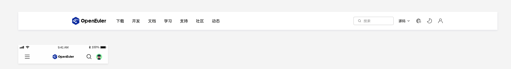

**用途：** 站点顶栏（稿面样本为 openEuler）。

**桌面**
- 左：Logo
- 中：主导航文案链（下载 / 开发 / 文档 / 学习 / 支持 / 社区 / 动态）
- 右：搜索框、「源码」下拉、语言、主题、用户

**移动**
- 左：汉堡菜单
- 中：Logo
- 右：搜索、头像

**样式：** 白底顶栏；主导航深色字；搜索浅灰圆角输入。

---

## 8. 底部导航

**用途：** 站点页脚导航与品牌区（稿面样本为 openEuler）。

**结构（自上而下）**
1. 基金会归属说明 + OpenAtom 标识
2. 六栏链接：关于 / 新闻与资讯 / 获取与下载 / 支持与服务 / 互动与交流 / 贡献与成长
3. 友情链接横排
4. 底栏：Logo + 邮箱 | 品牌 / 隐私 / 法律与版权 | 微信与社交入口

**样式：** 深色背景；栏目标题偏亮，链接偏灰；底部分隔线弱对比。

---

# 操作类

## 9. OButton 按钮

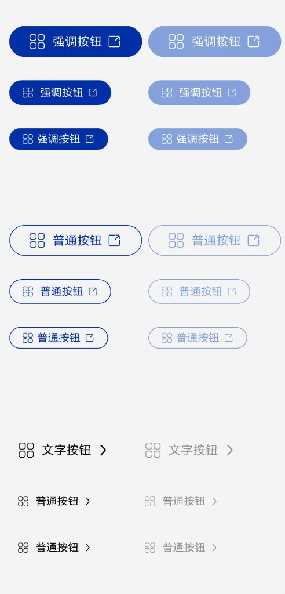

**用途：** 主操作触发；含左图标 / 文案 / 右外链图标。

**变体 × 尺寸 × 状态**

| 变体 | 正常 | 禁用 |
|------|------|------|
| 强调按钮 | 深蓝实心胶囊，白字白图标 | 浅蓝灰实心，白字 |
| 普通按钮 | 白底 + 蓝描边，蓝字蓝图标 | 白底 + 浅描边，浅灰蓝字 |
| 文字按钮 | 无底无边，深灰字；右为 `>` | 浅灰字 |

尺寸：大 / 中 / 小三档（胶囊圆角）。文字按钮小档稿面文案可为「普通按钮」。

---

## 10. OLink 链接

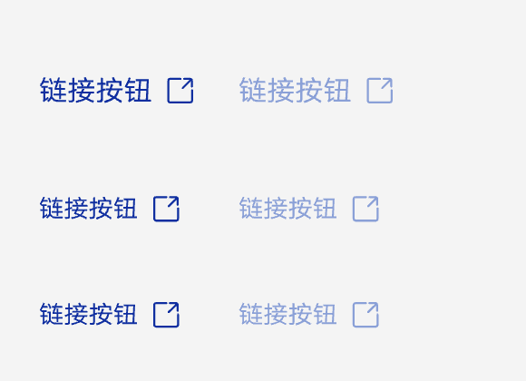

**用途：** 行内 / 跳转链接（常带外链箭头）。

**结构：** 文案「链接按钮」+ 右外链图标（方框斜箭）。

**状态 / 尺寸**
| | 正常 | 禁用 |
|--|------|------|
| 色 | 品牌蓝字 + 蓝图标 | 浅灰蓝字 + 图标 |
| 尺寸 | 大 / 中 / 小三档字号与图标缩放 |

---

## 11. ODropdown 下拉菜单

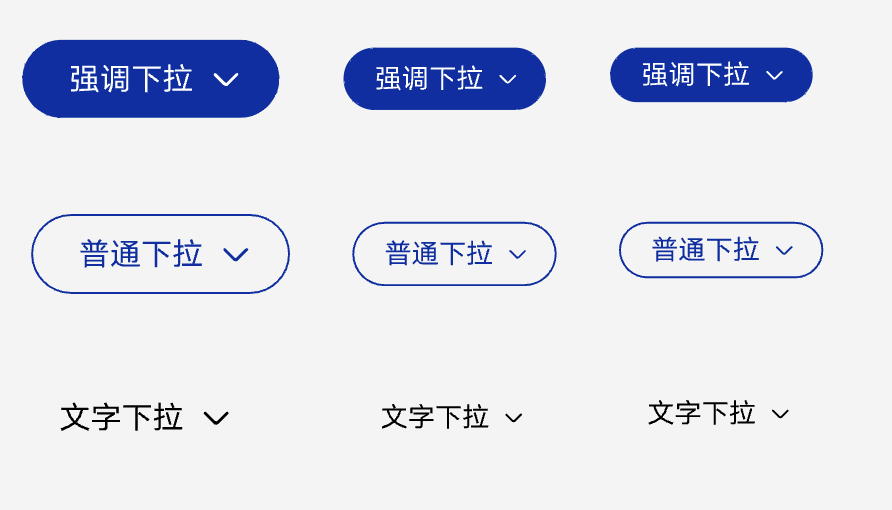

**用途：** 下拉触发器（面板列表未出镜）。

| 变体 | 表现 |
|------|------|
| 强调下拉 | 深蓝实心胶囊，白字 + 白向下箭头 |
| 普通下拉 | 白底蓝描边胶囊，蓝字 + 蓝箭头 |
| 文字下拉 | 无容器，深灰字 + 灰箭头 |

每变体大 / 中 / 小三档。

---

## 12. ORadio 单选框

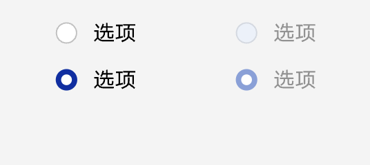

**用途：** 互斥单选；圆点 + 右侧标签「选项」。

| 状态 | 圆点 | 标签 |
|------|------|------|
| 未选 | 白底浅灰描边空心圆 | 深色字 |
| 已选 | 深蓝实心圆 + 中心白点 | 深色字 |
| 禁用未选 | 浅灰描边空心 | 浅灰字 |
| 禁用已选 | 浅紫蓝实心 + 白点 | 浅灰字 |

---

## 13. OCheckbox 多选框

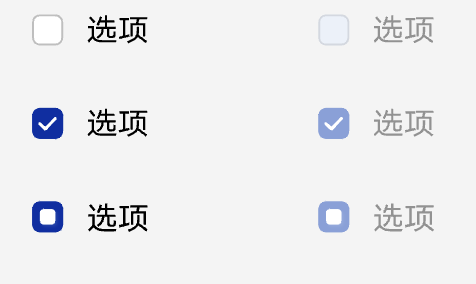

**用途：** 多选；圆角方框 + 标签「选项」。

| 状态 | 控件 | 标签 |
|------|------|------|
| 未选 | 白底深灰描边圆角方 | 深色字 |
| 已选 | 深蓝底 + 白勾 | 深色字 |
| 半选 / 不确定 | 深蓝底 + 白小方块 | 深色字 |
| 禁用（上三态） | 浅描边 / 浅紫蓝底 + 白标识 | 浅灰字 |

---

## 14. OSwitch 开关

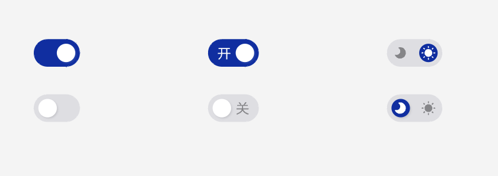

**用途：** 二元开关；胶囊轨道 + 圆形滑块。

| 变体 | 开 | 关 |
|------|----|----|
| 基础 | 深蓝轨，白滑块靠右 | 浅灰轨，白滑块靠左 |
| 带文案 | 轨内左「开」（白字） | 轨内右「关」（深灰字） |
| 主题图标 | 浅灰轨；深蓝滑块内白太阳，左侧灰月 | 浅灰轨；深蓝滑块内白月，右侧灰太阳 |

---

## 15. OScrollbar 滚动条

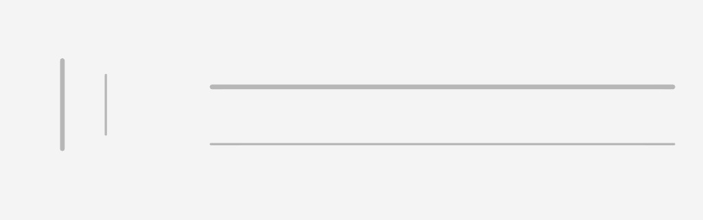

**用途：** 滚动区域滑块样式。

**形态**
- 纵向：粗 / 细两档灰条，圆角端
- 横向：粗 / 细两档灰条，圆角端

色为中性灰；无轨道装饰出镜。

---

## 16. OToggle 选择块

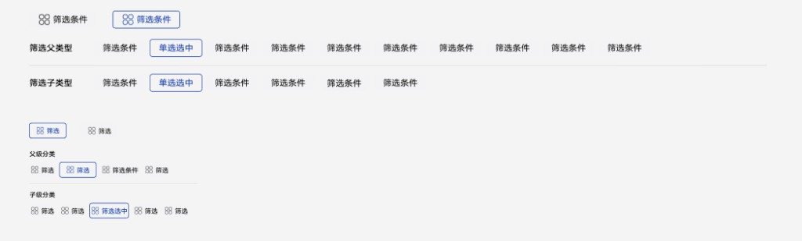

**用途：** 筛选 / 分类的块状单选（标签条），非整页 Radio。

**结构**
- 行标签：筛选条件 / 筛选父类型 / 筛选子类型 / 父级分类 / 子级分类
- 选项：纯文案，或「宫格图标 + 文案」

**状态**
| 状态 | 表现 |
|------|------|
| 未选 | 深灰字（可无边框） |
| 选中 | 蓝字 + 蓝描边圆角块（文案如「单选选中」「筛选选中」） |

可与左侧「筛选条件」入口按钮（图标+文案，选中时蓝描边）组合使用。

---

# 输入类

## 17. OInput 输入框

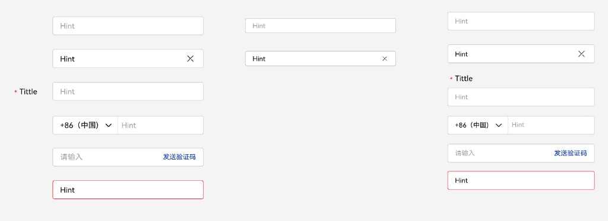

**用途：** 单行文本录入。

**形态**
| 形态 | 说明 |
|------|------|
| 基础 | 占位「Hint」，浅灰描边圆角框 |
| 可清除 | 右侧 × 清除 |
| 带标签 | 必填 `*` +「Tittle」；标签可在左侧或上方 |
| 前缀复合 | 左侧区号下拉「+86 (中国)」+ 主输入 |
| 后缀操作 | 占位「请输入」+ 右侧蓝字「发送验证码」 |
| 错误 | 红描边 |

含标准宽与紧凑宽两档示意。

---

## 18. OTextarea 多行文本输入框

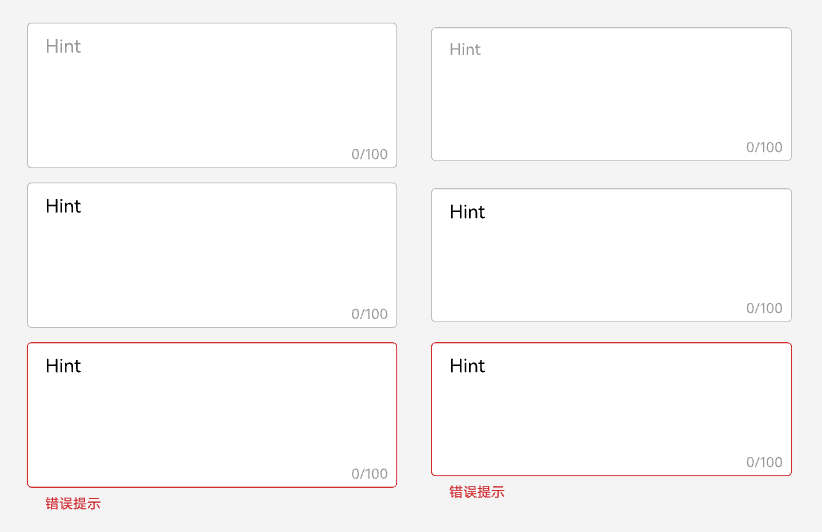

**用途：** 多行文本；左上占位「Hint」，右下字数「0/100」。

| 状态 | 表现 |
|------|------|
| 默认 | 浅灰描边，浅灰占位 |
| 激活 / 聚焦 | 描边加深，占位对比提高 |
| 错误 | 红描边 + 框下红字「错误提示」 |

---

## 19. OSearch 搜索框

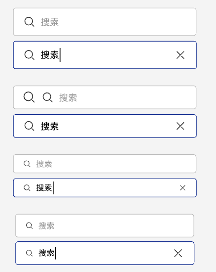

**用途：** 搜索录入；左放大镜 + 占位「搜索」。

| 状态 | 表现 |
|------|------|
| 默认 | 浅灰描边，灰占位 |
| 聚焦 | 深蓝描边，深色字 / 光标，右侧出现 × |

尺寸：大 / 中 / 小 / 更紧凑四档。中档默认可出现双放大镜示意（如分类内搜）。

---

## 20. OSelect 选择器

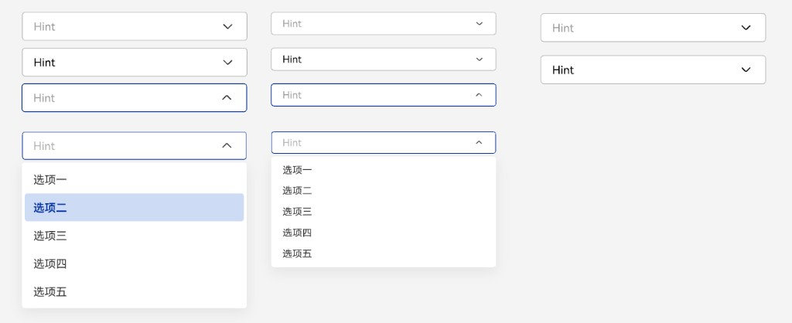

**用途：** 下拉单选；右箭头，占位「Hint」。

| 状态 | 表现 |
|------|------|
| 默认 | 浅灰描边，灰占位，箭头向下 |
| 激活文案 | 占位/文案变深 |
| 展开 | 蓝描边，箭头向上；下方白底阴影菜单 |
| 菜单项 | 默认深灰；悬停/选中浅蓝底 + 蓝字（如「选项二」） |

含标准与小号高度；菜单项示意「选项一…选项五」。

---

## 21. DatePicker 日期选择器

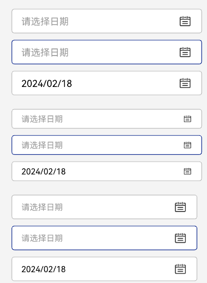

**用途：** 选日期；右日历图标。

| 状态 | 表现 |
|------|------|
| 默认 | 占位「请选择日期」，浅灰描边 |
| 聚焦 | 蓝描边 |
| 已选 | 深色日期文案，如 `2024/02/18` |

尺寸：大 / 中 / 小三档。面板日历未出镜。

---

## 22. TimePicker 时间选择器

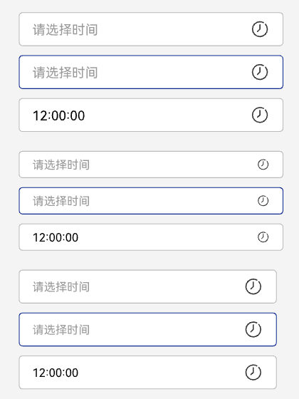

**用途：** 选时间；右时钟图标。

| 状态 | 表现 |
|------|------|
| 默认 | 占位「请选择时间」，浅灰描边 |
| 聚焦 | 蓝描边 |
| 已选 | 深色时间，如 `12:00:00` |

尺寸：中 / 小 / 大三档。面板未出镜。

---

## 23. Trees 树

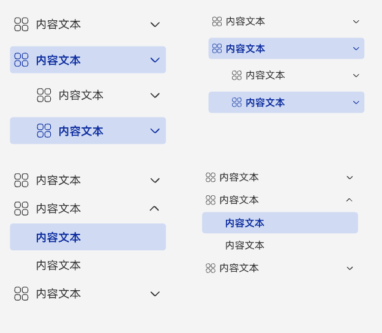

**用途：** 层级数据选择 / 浏览。

**结构：** 左宫格图标 +「内容文本」+ 右展开箭头；子级缩进；叶节点可无图标/箭头。

| 状态 | 表现 |
|------|------|
| 默认 | 深灰字 / 灰图标 |
| 选中 | 浅蓝圆角底，蓝字 / 蓝图标 / 蓝箭头 |
| 展开 | 箭头向上 |

示意含二～三级嵌套多种组合。

---

## 24. OUpload 上传

三张截图覆盖图片卡、拖拽区、按钮+文件列表。

### 24.1 图片上传卡

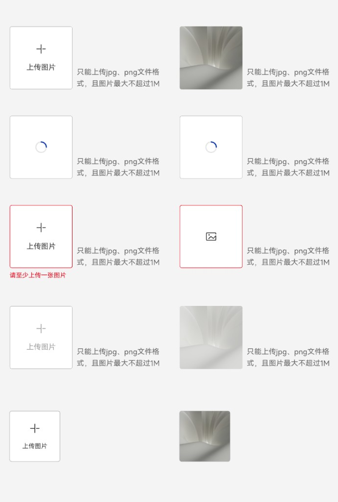

| 状态 | 表现 |
|------|------|
| 空态 | 方框 +「+」+「上传图片」；旁注格式/大小限制 |
| 成功 | 方框内预览图 |
| 上传中 | 蓝环形进度 |
| 错误 | 红描边；可有红字「请至少上传一张图片」 |
| 小尺寸 | 更小方卡（空态 / 预览） |

旁注文案示意：仅 jpg/png，最大 1M。

### 24.2 拖拽上传区

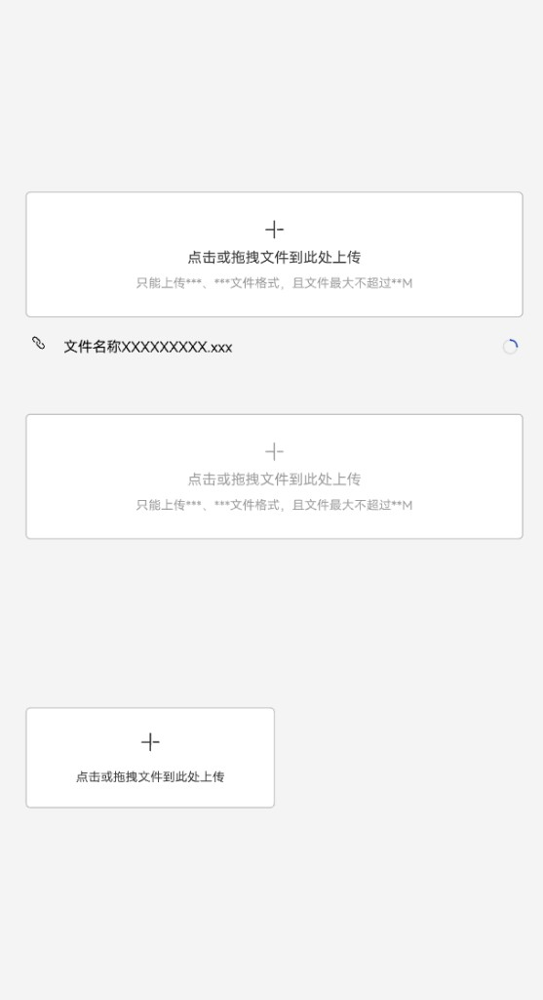

- 大区：中央「+」+「点击或拖拽文件到此处上传」+ 格式/大小副文案
- 下方文件行：链接图标 + 文件名 + 右侧蓝进度环
- 另有偏灰的次态 / 禁用示意，及无副文案的紧凑拖拽区

### 24.3 按钮 + 文件列表

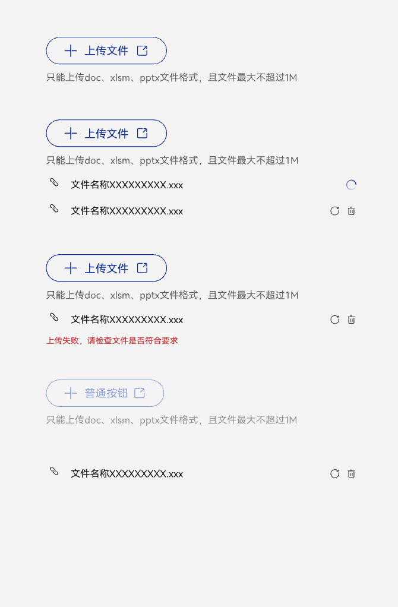

- 触发：蓝描边胶囊「上传文件」（左 + / 右外链图标）
- 说明：灰字格式限制（如 doc / xlsm / pptx，≤1M）
- 文件行：链接图标 + 文件名；右侧可为进度环，或 刷新 + 删除
- 失败：文件下红字「上传失败，请检查文件是否符合要求」
- 禁用触发：浅色「普通按钮」样式 + 列表

---

## 25. ORate 评分

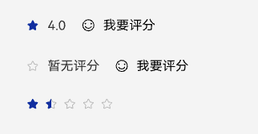

**用途：** 展示评分 / 引导用户评分。

| 形态 | 表现 |
|------|------|
| 有分摘要 | 实心蓝星 + 数值（如 `4.0`）+ 右侧「😊 我要评分」 |
| 暂无评分 | 空心灰星 +「暂无评分」+ 右侧「我要评分」 |
| 五星条 | 五颗星；支持半星（如 1.5：首星满、次星半蓝半空、其余空心灰） |

填充为品牌蓝，未填为浅灰描边星。

---

## 26. OCascader 级联选择

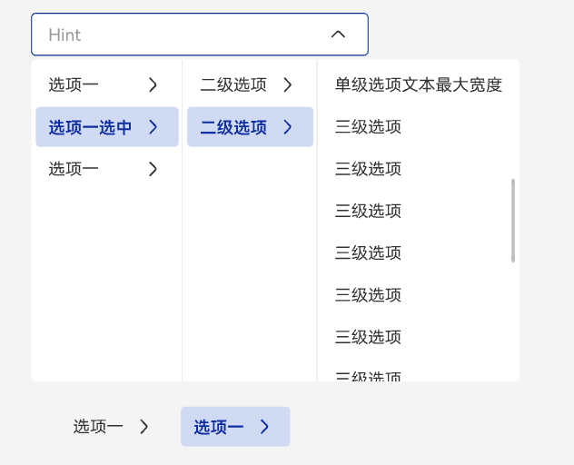

**用途：** 多级层级选择。

**结构**
- 触发框：占位「Hint」，展开时蓝描边 + 箭头向上
- 面板：白底阴影，多列并排（示意三级）
- 列项：文案 + 右箭头（有下级时）；末级可滚动（右侧滚动条）

| 状态 | 表现 |
|------|------|
| 路径选中 | 浅蓝底 + 蓝字（如「选项一选中」「二级选项」） |
| 默认项 | 深灰字，白底 |
| 长文案 | 示意「单级选项文本最大宽度」 |

稿面另单独示意菜单项默认 / 选中两态。

---

## 27. OSlider 滑动条

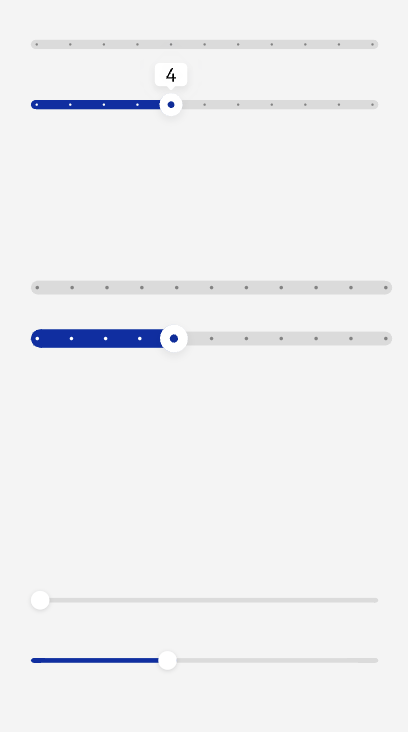

**用途：** 在连续或离散区间内取值。

| 变体 | 表现 |
|------|------|
| 细轨 + 刻度点 | 已滑深蓝轨（白点），未滑浅灰轨（灰点）；白圆滑块中心蓝点；可上浮气泡显示当前值（如 `4`） |
| 粗轨 + 刻度点 | 同上逻辑，轨道更粗、滑块更大 |
| 连续细轨 | 无刻度点；零位与部分填充两态 |

---

# 展示类

## 28. ODivider 分割线

**用途：** 分隔内容区块或行内元素。

| 方向 | 表现 |
|------|------|
| 水平 | 细浅灰横线（稿面示意两条） |
| 垂直 | 短细浅灰竖线（稿面示意两条并排） |

无文案 / 图标装饰，极简中性灰。

---

## 29. OTag 标签

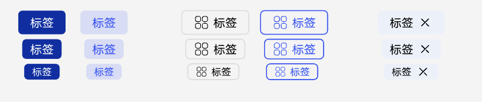

**用途：** 分类、状态或可关闭的标记；文案示意「标签」。

| 样式 | 表现 |
|------|------|
| 实心主色 | 深蓝底白字 |
| 浅底主色 | 浅紫蓝底 + 深蓝字 |
| 描边中性 + 图标 | 浅灰描边，深字，左宫格灰图标 |
| 描边主色 + 图标 | 蓝描边蓝字，左宫格蓝图标 |
| 可关闭 | 浅底 + 深字 + 右 × |

尺寸：大 / 中 / 小三档（圆角矩形）。

---

## 30. OBadge 徽标

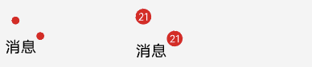

**用途：** 未读 / 数量提示，挂在宿主右上角。

| 形态 | 表现 |
|------|------|
| 圆点 | 纯红小圆点；可叠在「消息」右上 |
| 数字 | 红底白字圆标（如 `21`）；可叠在「消息」右上 |

---

# 容器类

## 31. OCarousel 幻灯片

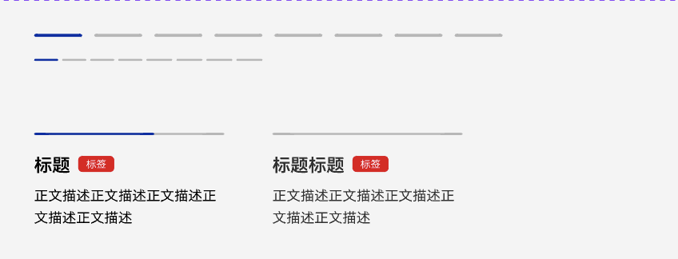

**用途：** 轮播切换；含指示条与幻灯内容块。

**指示器**
- 分段横条：当前段深蓝，其余浅灰（稿面示意 8 段 / 6 段）

**内容块**
- 顶进度线：当前片可部分深蓝填充，未播整段浅灰
- 标题「标题」+ 右侧红底白字标签「标签」
- 下方灰字正文描述

---

## 32. ODialog 对话框

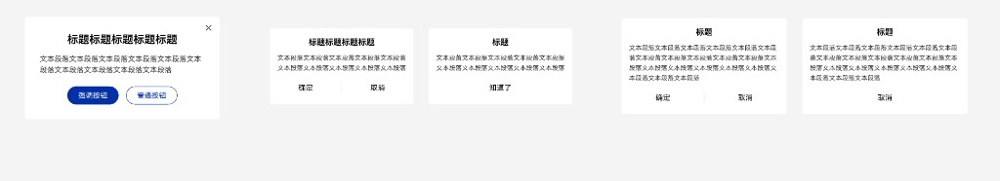

**用途：** 模态确认 / 提示；白底圆角居中卡片。

| 变体 | 表现 |
|------|------|
| 标准双按钮 | 标题 + 可选右上 ×；正文；底栏强调实心按钮 + 描边普通按钮 |
| 文字双按钮 | 标题 + 正文；底栏「确定 | 取消」文字钮，中间竖分割线 |
| 单文字钮 | 短标题 + 正文；底栏居中「知道了」或「取消」 |
| 长正文 | 同上底栏结构，正文行数更多 |

标题加粗居中，正文灰字居中。

---

## 33. OCard 卡片

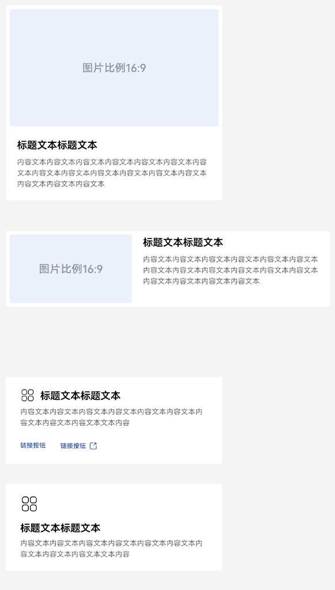

**用途：** 信息块容器；白底圆角轻阴影。

| 布局 | 结构 |
|------|------|
| 上图下文 | 顶 16:9 图位 + 标题 + 灰正文 |
| 左图右文 | 左 16:9 图位 + 右标题与正文 |
| 图标标题 + 操作 | 左宫格图标 + 标题；正文；底栏蓝「链接按钮」（可带外链图标） |
| 上图标下文 | 顶居中宫格图标 + 标题 + 正文 |

---

## 34. Odate-table 数据表格

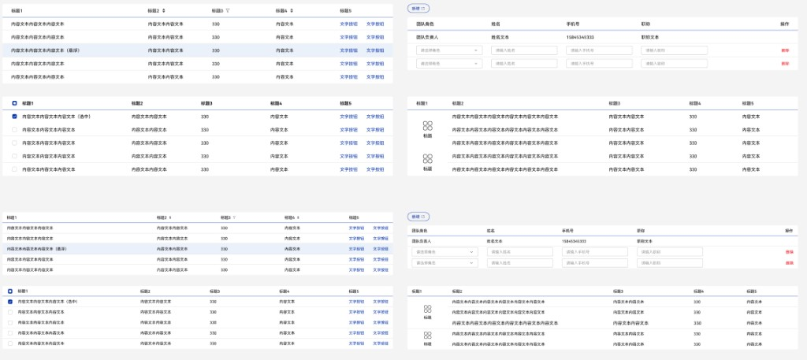

**用途：** 列表数据展示 / 行内编辑。

**能力示意**
| 能力 | 表现 |
|------|------|
| 基础表 | 表头 + 斑马纹/白底行；操作列蓝「文字按钮 / 文字链接」 |
| 排序 / 筛选 | 表头上下箭头、漏斗图标 |
| 行选中 | 整行浅蓝底；可含左侧 Checkbox（含表头全选） |
| 可编辑表 | 上方「新增」描边按钮；单元格为 Select / Input；删除为红字「删除」；表头下可有深蓝分隔线 |
| 富内容行 | 左图标/头像 + 粗标题；多行正文列 |

整体：白底、浅灰线、蓝主操作、红危险操作。

---

# 反馈类

## 35. OProgress 进度条

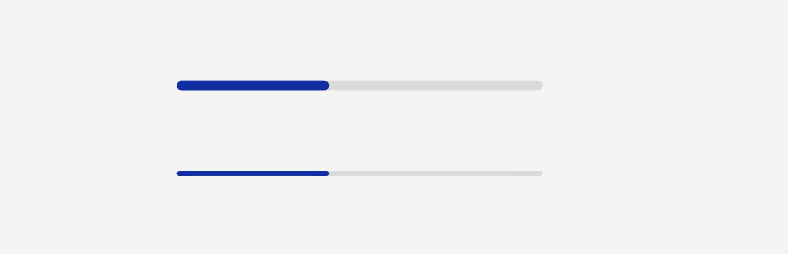

**用途：** 线性进度展示。

| 形态 | 表现 |
|------|------|
| 粗条 | 圆角胶囊轨；已完成深蓝，未完成浅灰（示意约 40%） |
| 细条 | 同上配色，轨道更细 |

---

## 36. OMessage 消息提示

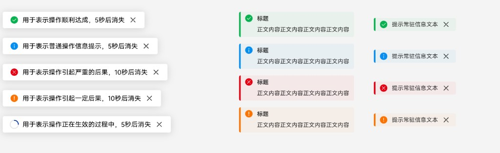

**用途：** 操作结果 / 状态反馈；含浮层与内嵌提示多形态。

**浮层条（左栏）**  
白底圆角阴影；左状态图标 + 文案 + 右 ×。

| 类型 | 图标色 | 文案要点 |
|------|--------|----------|
| 成功 | 绿勾 | 操作顺利达成，约 5s 消失 |
| 信息 | 蓝 i | 普通信息提示，约 5s |
| 错误 | 红 × | 严重后果，约 10s |
| 警告 | 橙 ! | 一定后果，约 10s |
| 加载中 | 灰环进度 | 操作进行中，约 5s |

**详情告警（中栏）**  
浅色底 + 左侧色条；图标 + 粗标题 + 多行正文。成功绿 / 信息蓝 / 错误红 / 警告橙。

**常驻紧凑条（右栏）**  
同色系浅底 + 左色条；单行「提示常驻信息文本」+ 右 ×。

---

## 37. OToast 轻提示

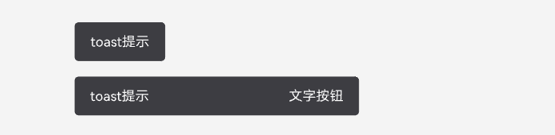

**用途：** 轻量深色浮层提示。

| 变体 | 表现 |
|------|------|
| 纯文案 | 深灰底圆角条，白字居中「toast提示」 |
| 带操作 | 更宽条；左白字提示，右「文字按钮」 |

---

## 38. 气泡卡片

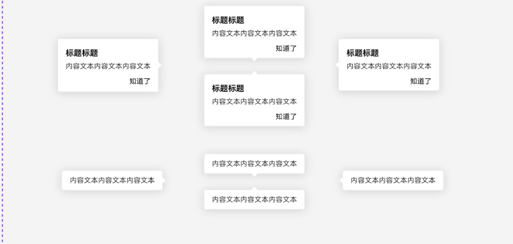

**用途：** 锚定触发源的浮层说明（Popover）。

| 内容 | 表现 |
|------|------|
| 富内容 | 标题「标题标题」+ 多行正文 + 右下「知道了」 |
| 纯正文 | 仅「内容文本…」 |

白底圆角轻阴影；三角尖可朝上 / 下 / 左 / 右。

---

## 39. OLoading 加载

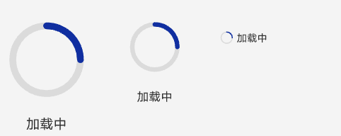

**用途：** 加载中指示。

- 浅灰圆环轨 + 深蓝圆弧（约 1/4 周，圆角端）
- 文案「加载中」

| 尺寸 | 文案位置 |
|------|----------|
| 大 / 中 | 圆环下方居中 |
| 小 | 圆环右侧 |

---

## 共用视觉倾向（从截图归纳）

| Token 倾向 | 用途 |
|------------|------|
| 品牌蓝（选中字 / 指示条 / 当前页底 / 强调按钮 / 聚焦描边） | 交互选中、主操作、输入聚焦、上传进度 |
| 错误红 / 徽标红 | 输入/上传校验失败；Badge；Message 错误 |
| 成功绿 / 警告橙 | Message / 告警条状态色 |
| 浅蓝灰 | 按钮 / 链接 / 表控禁用态 |
| 浅绿 / 绿 | 步骤「已完成」；成功反馈 |
| 深灰 Toast 底 | OToast 轻提示容器 |
| 深灰字 | 默认正文 / 已填值 / 菜单 / 页签 |
| 中灰字 | 占位符、辅助说明、面包屑祖先 |
| 浅蓝选中底 | 菜单 / 树 / Select 菜单项选中 |
| 浅灰容器底 | 分段页签、分页边框、开关关态 |
| 中性灰条 | 滚动条滑块 |
| 深色页脚底 | 底部导航 |

> 精确色值以 Pixso Token / 标注为准；上表仅作截图级归纳，后续可补 Design Token 表。

---

## 待补充

- [ ] 各组件精确色值、字号、间距 Token
- [ ] Hover / Focus 全状态补全
- [ ] DatePicker / TimePicker 面板展开态
- [ ] 其他未截图组件
